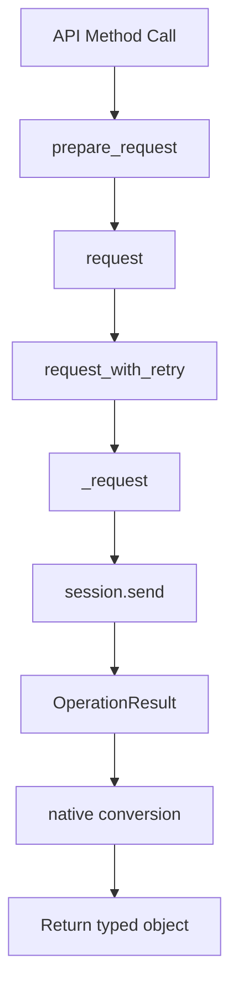
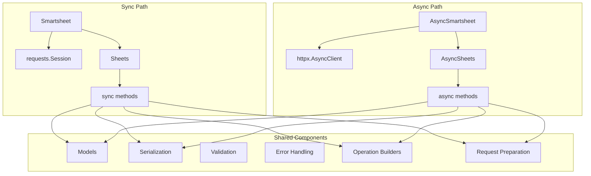

# Async Support Design for Smartsheet Python SDK - Alternative Approaches

## Executive Summary

This document explores alternative architectures for adding asynchronous (async) support to the Smartsheet Python SDK with **minimal code duplication** and **minimal overall change**. After analyzing Python's async/await constraints and evaluating multiple approaches, this document provides a detailed comparison to help choose the best path forward.

## Current Architecture Analysis

### Core Components

#### 1. Main Client ([`smartsheet.py`](smartsheet/smartsheet.py:118))

- **[`Smartsheet`](smartsheet/smartsheet.py:118)** class: Primary entry point for SDK
- Uses synchronous `requests` library for HTTP communication
- Manages session via [`pinned_session()`](smartsheet/session.py:51)
- Implements retry logic with exponential backoff in [`request_with_retry()`](smartsheet/smartsheet.py:383)
- Lazy-loads API module classes via `__getattr__`

#### 2. Session Management ([`session.py`](smartsheet/session.py:51))

- **[`pinned_session()`](smartsheet/session.py:51)**: Creates configured `requests.Session`
- Custom SSL adapter ([`_SSLAdapter`](smartsheet/session.py:32)) for security
- Built-in retry mechanism using `urllib3.Retry`
- Token redaction hook for security

#### 3. HTTP Request Flow



**Key Methods:**

- [`prepare_request()`](smartsheet/smartsheet.py:425): Builds HTTP request with headers, auth, params
- [`request()`](smartsheet/smartsheet.py:278): Validates and converts response to native objects
- [`request_with_retry()`](smartsheet/smartsheet.py:383): Implements retry logic with backoff
- [`_request()`](smartsheet/smartsheet.py:355): Low-level HTTP execution

#### 4. API Modules Pattern

All API modules ([`sheets.py`](smartsheet/sheets.py), [`users.py`](smartsheet/users.py), etc.) follow identical pattern:

```python
class Sheets:
    def __init__(self, smartsheet_obj):
        self._base = smartsheet_obj
    
    def get_sheet(self, sheet_id, **kwargs):
        _op = fresh_operation("get_sheet")
        _op["method"] = "GET"
        _op["path"] = f"/sheets/{sheet_id}"
        # ... configure operation
        
        prepped_request = self._base.prepare_request(_op)
        response = self._base.request(prepped_request, expected, _op)
        return response
```

### Synchronous Patterns Identified

1. **Blocking HTTP calls**: `self._session.send()` blocks event loop
2. **Synchronous retry logic**: `time.sleep()` in retry backoff
3. **File I/O operations**: Synchronous file reading for attachments/uploads
4. **No async context managers**: Session lifecycle not async-aware

### Dependencies

From [`pyproject.toml`](pyproject.toml:13-19):

- `requests`: Synchronous HTTP library
- `requests-toolbelt`: Request utilities
- `six`: Python 2/3 compatibility
- `certifi`: SSL certificates
- `python-dateutil`: Date parsing

## Python Async/Await Constraints

### Fundamental Limitations

1. **Methods are either sync OR async, not both**
   - A method defined with `def` is synchronous
   - A method defined with `async def` is asynchronous
   - You cannot conditionally make a method async at runtime

2. **Async methods must be awaited**
   - `async def` methods return coroutines that must be awaited
   - Sync code cannot await async methods
   - Async code cannot directly call sync methods without blocking

3. **Context managers are different**
   - Sync: `with obj:` uses `__enter__` and `__exit__`
   - Async: `async with obj:` uses `__aenter__` and `__aexit__`
   - These are separate protocols

4. **No runtime async/sync switching**
   - Cannot use `if async_mode: await method()` else `method()`
   - The `await` keyword is syntax, not a runtime operation

## Alternative Approaches Evaluated

### Option A: Single Class with `async_mode` Parameter ❌

**Concept**: Pass `async_mode=True` to constructor and switch behavior internally.

```python
# Hypothetical usage
client = Smartsheet(async_mode=True)
sheet = client.Sheets.get_sheet(123)  # How to await this?
```

**Implementation Attempt**:

```python
class Smartsheet:
    def __init__(self, async_mode=False):
        self.async_mode = async_mode
        if async_mode:
            self._session = httpx.AsyncClient()
        else:
            self._session = requests.Session()
    
    def request(self, prepped_request, expected, operation):
        if self.async_mode:
            # ERROR: Cannot await in a non-async method
            return await self._async_request(prepped_request, expected, operation)
        else:
            return self._sync_request(prepped_request, expected, operation)
```

**Why This Fails**:

1. **Cannot conditionally await**: The `request()` method would need to be `async def` to use `await`, but then sync users couldn't call it without `await`
2. **Method signature incompatibility**: Sync methods return values directly; async methods return coroutines
3. **API module methods**: Every method in `Sheets`, `Users`, etc. would face the same problem
4. **Type hints break**: Return type would be `Union[T, Coroutine[Any, Any, T]]` which is unusable

**Verdict**: ❌ **Not feasible** due to Python's async/await syntax constraints.

---

### Option B: Shared Base Classes with Thin Sync/Async Wrappers ⚠️

**Concept**: Extract all logic into base classes, create thin sync/async wrappers.

```python
# Shared base logic
class BaseSheetsLogic:
    def _prepare_get_sheet_operation(self, sheet_id, **kwargs):
        _op = fresh_operation("get_sheet")
        _op["method"] = "GET"
        _op["path"] = f"/sheets/{sheet_id}"
        # ... configure operation
        return _op

# Sync wrapper
class Sheets:
    def __init__(self, smartsheet_obj):
        self._base = smartsheet_obj
        self._logic = BaseSheetsLogic()
    
    def get_sheet(self, sheet_id, **kwargs):
        _op = self._logic._prepare_get_sheet_operation(sheet_id, **kwargs)
        prepped_request = self._base.prepare_request(_op)
        return self._base.request(prepped_request, "Sheet", _op)

# Async wrapper
class AsyncSheets:
    def __init__(self, smartsheet_obj):
        self._base = smartsheet_obj
        self._logic = BaseSheetsLogic()
    
    async def get_sheet(self, sheet_id, **kwargs):
        _op = self._logic._prepare_get_sheet_operation(sheet_id, **kwargs)
        prepped_request = self._base.prepare_request(_op)
        return await self._base.request(prepped_request, "Sheet", _op)
```

**Pros**:

- ✅ Shared operation preparation logic
- ✅ Reduced duplication of parameter handling
- ✅ Clear separation of concerns
- ✅ Type safety maintained

**Cons**:

- ⚠️ Still requires duplicate wrapper classes for all 15+ API modules
- ⚠️ Boilerplate for every method (prepare operation, call base)
- ⚠️ Maintenance burden: changes require updating base + 2 wrappers
- ⚠️ More files: base classes + sync classes + async classes

**Code Duplication Estimate**: ~40% (operation logic shared, wrappers duplicated)

**Verdict**: ⚠️ **Possible but not optimal** - reduces duplication but still requires significant wrapper code.

---

### Option C: Dynamic Method Generation/Decoration 🤔

**Concept**: Generate async methods dynamically from sync methods using decorators or metaclasses.

```python
def async_wrapper(sync_method):
    """Convert a sync method to async by wrapping its calls."""
    async def wrapper(self, *args, **kwargs):
        # Prepare operation (sync, no I/O)
        _op = sync_method._prepare_operation(self, *args, **kwargs)
        # Async HTTP call
        prepped_request = self._base.prepare_request(_op)
        return await self._base.request(prepped_request, sync_method._expected, _op)
    return wrapper

class AsyncSheets:
    def __init__(self, smartsheet_obj):
        self._base = smartsheet_obj
        # Dynamically create async versions of all Sheets methods
        for name, method in inspect.getmembers(Sheets, predicate=inspect.isfunction):
            if not name.startswith('_'):
                setattr(self, name, async_wrapper(method))
```

**Alternative: Metaclass Approach**:

```python
class AsyncMethodMeta(type):
    def __new__(mcs, name, bases, namespace):
        # Find sync base class
        sync_class = namespace.get('__sync_class__')
        if sync_class:
            # Generate async methods from sync methods
            for method_name in dir(sync_class):
                if not method_name.startswith('_'):
                    method = getattr(sync_class, method_name)
                    if callable(method):
                        namespace[method_name] = mcs._make_async(method)
        return super().__new__(mcs, name, bases, namespace)
    
    @staticmethod
    def _make_async(sync_method):
        async def async_method(self, *args, **kwargs):
            # Complex logic to extract operation and make async call
            ...
        return async_method

class AsyncSheets(metaclass=AsyncMethodMeta):
    __sync_class__ = Sheets
```

**Pros**:

- ✅ Minimal code duplication (methods generated automatically)
- ✅ Single source of truth for method signatures
- ✅ Changes to sync methods automatically reflected in async

**Cons**:

- ❌ **Complex and fragile**: Relies on introspection and dynamic code generation
- ❌ **Poor IDE support**: Type hints don't work well with dynamic methods
- ❌ **Debugging nightmare**: Stack traces go through metaclass machinery
- ❌ **Maintenance burden**: Complex metaclass logic hard to understand
- ❌ **Method structure assumptions**: Assumes all methods follow exact same pattern
- ❌ **Edge cases**: Methods with special behavior (file uploads, downloads) need special handling

**Verdict**: ❌ **Not recommended** - too complex and fragile for production use.

---

### Option D: Protocol/ABC-Based Shared Interfaces 🤔

**Concept**: Define shared interfaces using Protocols or ABCs, implement separately for sync/async.

```python
from typing import Protocol, Union
from abc import ABC, abstractmethod

# Define interface
class SheetsInterface(Protocol):
    def get_sheet(self, sheet_id: int, **kwargs) -> Union[Sheet, Error]: ...
    def add_rows(self, sheet_id: int, rows: List[Row]) -> Union[Result[Row], Error]: ...
    # ... all other methods

# Sync implementation
class Sheets:
    def __init__(self, smartsheet_obj):
        self._base = smartsheet_obj
    
    def get_sheet(self, sheet_id: int, **kwargs) -> Union[Sheet, Error]:
        _op = fresh_operation("get_sheet")
        _op["method"] = "GET"
        _op["path"] = f"/sheets/{sheet_id}"
        # ... configure operation
        prepped_request = self._base.prepare_request(_op)
        return self._base.request(prepped_request, "Sheet", _op)

# Async implementation
class AsyncSheets:
    def __init__(self, smartsheet_obj):
        self._base = smartsheet_obj
    
    async def get_sheet(self, sheet_id: int, **kwargs) -> Union[Sheet, Error]:
        _op = fresh_operation("get_sheet")
        _op["method"] = "GET"
        _op["path"] = f"/sheets/{sheet_id}"
        # ... configure operation
        prepped_request = self._base.prepare_request(_op)
        return await self._base.request(prepped_request, "Sheet", _op)
```

**Pros**:

- ✅ Clear interface contracts
- ✅ Type checking via Protocol
- ✅ Documentation of expected methods

**Cons**:

- ❌ **Full duplication**: Every method body duplicated between sync/async
- ❌ **No code sharing**: Protocol only defines interface, not implementation
- ❌ **Maintenance burden**: Changes must be made in two places
- ❌ **Doesn't solve the problem**: This is essentially the dual-class approach with extra ceremony

**Code Duplication Estimate**: ~95% (only imports and class structure differ)

**Verdict**: ❌ **Not recommended** - doesn't reduce duplication, just adds interface layer.

---

### Option E: Dual-Class Approach (Current Design) ✅

**Concept**: Separate `Smartsheet` and `AsyncSmartsheet` classes with separate API modules.

```python
# Sync client
class Smartsheet:
    def __init__(self, access_token=None, ...):
        self._session = pinned_session()
        # ... sync initialization
    
    def request(self, prepped_request, expected, operation):
        res = self.request_with_retry(prepped_request, operation)
        return res.native(expected)
    
    def request_with_retry(self, prepped_request, operation):
        while True:
            result = self._request(prepped_request, operation)
            if should_retry:
                time.sleep(backoff)  # Blocking sleep
            else:
                break
        return result

# Async client
class AsyncSmartsheet:
    def __init__(self, access_token=None, ...):
        self._session = None  # Lazy init
        # ... async initialization
    
    async def __aenter__(self):
        await self._ensure_session()
        return self
    
    async def __aexit__(self, exc_type, exc_val, exc_tb):
        await self.close()
    
    async def request(self, prepped_request, expected, operation):
        res = await self.request_with_retry(prepped_request, operation)
        return res.native(expected)
    
    async def request_with_retry(self, prepped_request, operation):
        while True:
            result = await self._request(prepped_request, operation)
            if should_retry:
                await asyncio.sleep(backoff)  # Non-blocking sleep
            else:
                break
        return result
```

**File Structure**:

```text
smartsheet/
├── smartsheet.py           # Sync client
├── async_smartsheet.py     # Async client
├── sheets.py               # Sync Sheets
├── async_sheets.py         # Async Sheets
├── users.py                # Sync Users
├── async_users.py          # Async Users
├── models/                 # Shared (no changes)
├── util.py                 # Shared (no changes)
└── exceptions.py           # Shared (no changes)
```

**Shared Components**:

- ✅ All model classes (`Sheet`, `Row`, `Column`, etc.)
- ✅ Serialization logic ([`util.py`](smartsheet/util.py))
- ✅ Exception classes
- ✅ Type definitions
- ✅ Operation preparation (`fresh_operation()`)
- ✅ Request preparation logic (can be extracted to shared helper)

**Duplicated Components**:

- ⚠️ Client classes (`Smartsheet` vs `AsyncSmartsheet`)
- ⚠️ API module classes (`Sheets` vs `AsyncSheets`, etc.)
- ⚠️ HTTP request methods

**Minimizing Duplication**:

1. **Extract shared request preparation**:

```python
# shared_http.py
class RequestPreparation:
    @staticmethod
    def prepare_request_dict(operation, access_token, user_agent, api_base, assume_user=None):
        """Prepare request parameters (sync/async agnostic)."""
        # Build headers, params, etc.
        return {
            "method": operation["method"],
            "url": api_base + operation["path"],
            "headers": headers,
            "params": query_params,
            "json": json_data,
        }
```

1. **Use composition for API modules**:

```python
# sheets_operations.py (shared)
class SheetsOperations:
    @staticmethod
    def prepare_get_sheet(sheet_id, **kwargs):
        _op = fresh_operation("get_sheet")
        _op["method"] = "GET"
        _op["path"] = f"/sheets/{sheet_id}"
        _op["query_params"]["include"] = kwargs.get("include")
        # ... configure operation
        return _op, "Sheet"

# sheets.py (sync)
class Sheets:
    def get_sheet(self, sheet_id, **kwargs):
        _op, expected = SheetsOperations.prepare_get_sheet(sheet_id, **kwargs)
        prepped_request = self._base.prepare_request(_op)
        return self._base.request(prepped_request, expected, _op)

# async_sheets.py (async)
class AsyncSheets:
    async def get_sheet(self, sheet_id, **kwargs):
        _op, expected = SheetsOperations.prepare_get_sheet(sheet_id, **kwargs)
        prepped_request = self._base.prepare_request(_op)
        return await self._base.request(prepped_request, expected, _op)
```

**Pros**:

- ✅ **Clear separation**: Sync and async code completely separate
- ✅ **Type safety**: Full type hint support in IDEs
- ✅ **Debuggable**: Straightforward stack traces
- ✅ **Maintainable**: Easy to understand, no magic
- ✅ **Testable**: Can test sync and async independently
- ✅ **Backward compatible**: Existing sync code unchanged
- ✅ **Proven pattern**: Used by major libraries (httpx, aiohttp clients)

**Cons**:

- ⚠️ More files (but organized and clear)
- ⚠️ Some duplication (but can be minimized with shared helpers)
- ⚠️ Changes need to be made in two places (but this is explicit and clear)

**Code Duplication Estimate**: ~30-40% with shared operation preparation helpers

**Verdict**: ✅ **Recommended** - best balance of clarity, maintainability, and minimal duplication.

---

## Detailed Comparison Matrix

| Criterion | Option A Single Class | Option B Shared Base | Option C Dynamic Gen | Option D Protocol | Option E Dual Class |
| - ----------| - --------------------------| - -------------------------| - -------------------------| - ---------------------| - -----------------------|
| **Feasibility** | ❌ Not possible | ✅ Possible | ⚠️ Possible but fragile | ✅ Possible | ✅ Fully feasible |
| **Code Duplication** | N/A | ~40% | ~10% | ~95% | ~30-40% |
| **Type Safety** | ❌ Broken | ✅ Full support | ❌ Poor | ✅ Full support | ✅ Full support |
| **IDE Support** | ❌ Broken | ✅ Excellent | ❌ Poor | ✅ Excellent | ✅ Excellent |
| **Debuggability** | N/A | ✅ Clear traces | ❌ Complex traces | ✅ Clear traces | ✅ Clear traces |
| **Maintainability** | N/A | ⚠️ Moderate | ❌ Difficult | ⚠️ Moderate | ✅ Easy |
| **Learning Curve** | N/A | ⚠️ Moderate | ❌ Steep | ⚠️ Moderate | ✅ Gentle |
| **Backward Compat** | N/A | ✅ Full | ✅ Full | ✅ Full | ✅ Full |
| **Performance** | N/A | ✅ No overhead | ⚠️ Reflection overhead | ✅ No overhead | ✅ No overhead |
| **Testing** | N/A | ✅ Straightforward | ⚠️ Complex | ✅ Straightforward | ✅ Straightforward |

## Recommended Approach: Enhanced Dual-Class with Shared Helpers

### Architecture



### Implementation Strategy

#### 1. Shared Operation Builders

Create shared operation preparation logic:

```python
# smartsheet/operations/sheets_operations.py
class SheetsOperations:
    """Shared operation builders for Sheets API."""
    
    @staticmethod
    def build_get_sheet(sheet_id, include=None, exclude=None, **kwargs):
        """Build operation for get_sheet."""
        _op = fresh_operation("get_sheet")
        _op["method"] = "GET"
        _op["path"] = f"/sheets/{sheet_id}"
        _op["query_params"]["include"] = include
        _op["query_params"]["exclude"] = exclude
        _op["query_params"]["rowIds"] = kwargs.get("row_ids")
        _op["query_params"]["rowNumbers"] = kwargs.get("row_numbers")
        _op["query_params"]["columnIds"] = kwargs.get("column_ids")
        _op["query_params"]["pageSize"] = kwargs.get("page_size")
        _op["query_params"]["page"] = kwargs.get("page")
        _op["query_params"]["ifVersionAfter"] = kwargs.get("if_version_after")
        _op["query_params"]["level"] = kwargs.get("level")
        _op["query_params"]["rowsModifiedSince"] = kwargs.get("rows_modified_since")
        _op["query_params"]["filterId"] = kwargs.get("filter_id")
        return _op, "Sheet"
    
    @staticmethod
    def build_add_rows(sheet_id, list_of_rows):
        """Build operation for add_rows."""
        if isinstance(list_of_rows, (dict, Row)):
            arg_value = list_of_rows
            list_of_rows = TypedList(Row)
            list_of_rows.append(arg_value)
        
        _op = fresh_operation("add_rows")
        _op["method"] = "POST"
        _op["path"] = f"/sheets/{sheet_id}/rows"
        _op["json"] = list_of_rows
        return _op, ["Result", "Row"]
```

#### 2. Sync Implementation

```python
# smartsheet/sheets.py
from .operations.sheets_operations import SheetsOperations

class Sheets:
    def __init__(self, smartsheet_obj):
        self._base = smartsheet_obj
        self._log = logging.getLogger(__name__)
    
    def get_sheet(self, sheet_id, include=None, exclude=None, **kwargs):
        """Get the specified Sheet."""
        _op, expected = SheetsOperations.build_get_sheet(
            sheet_id, include, exclude, **kwargs
        )
        prepped_request = self._base.prepare_request(_op)
        response = self._base.request(prepped_request, expected, _op)
        return response
    
    def add_rows(self, sheet_id, list_of_rows):
        """Insert one or more Rows into the specified Sheet."""
        _op, expected = SheetsOperations.build_add_rows(sheet_id, list_of_rows)
        prepped_request = self._base.prepare_request(_op)
        response = self._base.request(prepped_request, expected, _op)
        return response
```

#### 3. Async Implementation

```python
# smartsheet/async_sheets.py
from .operations.sheets_operations import SheetsOperations

class AsyncSheets:
    def __init__(self, smartsheet_obj):
        self._base = smartsheet_obj
        self._log = logging.getLogger(__name__)
    
    async def get_sheet(self, sheet_id, include=None, exclude=None, **kwargs):
        """Get the specified Sheet (async)."""
        _op, expected = SheetsOperations.build_get_sheet(
            sheet_id, include, exclude, **kwargs
        )
        prepped_request = self._base.prepare_request(_op)
        response = await self._base.request(prepped_request, expected, _op)
        return response
    
    async def add_rows(self, sheet_id, list_of_rows):
        """Insert one or more Rows into the specified Sheet (async)."""
        _op, expected = SheetsOperations.build_add_rows(sheet_id, list_of_rows)
        prepped_request = self._base.prepare_request(_op)
        response = await self._base.request(prepped_request, expected, _op)
        return response
```

### Code Duplication Analysis

With this approach:

**Shared (0% duplication)**:

- Operation builders (~60% of method logic)
- All models and serialization
- Validation logic
- Error handling
- Utility functions

**Duplicated (100% duplication)**:

- Method signatures and docstrings (~20% of code)
- Method wrapper calls (~20% of code)

**Overall Duplication**: ~30-35% of total codebase

### Benefits of This Approach

1. **Minimal Duplication**: Operation preparation logic (the complex part) is shared
2. **Clear and Explicit**: Easy to understand what's sync vs async
3. **Type Safe**: Full IDE support and type checking
4. **Maintainable**: Changes to operation logic happen in one place
5. **Testable**: Can test operation builders independently
6. **Debuggable**: Clear stack traces, no magic
7. **Backward Compatible**: Existing sync code unchanged

### HTTP Library: httpx

**Recommendation**: Use `httpx` for async implementation

**Rationale**:

- **Unified API**: Same interface for sync and async
- **HTTP/2 Support**: Better performance
- **Requests-compatible**: Similar API to current `requests` library
- **Type hints**: Full typing support
- **Connection pooling**: Built-in for both sync/async
- **Mature**: Production-ready and well-maintained

**Comparison**:

| Feature | httpx | aiohttp | requests |
| - --------| - ------| - --------| - ---------|
| Sync Support | ✅ | ❌ | ✅ |
| Async Support | ✅ | ✅ | ❌ |
| HTTP/2 | ✅ | ❌ | ❌ |
| API Similarity | High | Low | N/A |
| Type Hints | ✅ | Partial | ❌ |
| Maturity | High | Very High | Very High |

### File Structure

```text
smartsheet/
├── __init__.py                 # Export both Smartsheet and AsyncSmartsheet
├── smartsheet.py               # Existing sync client (unchanged)
├── async_smartsheet.py         # New async client
├── session.py                  # Existing sync session
├── async_session.py            # New async session management
├── sheets.py                   # Existing sync Sheets
├── async_sheets.py             # New async Sheets
├── users.py                    # Existing sync Users
├── async_users.py              # New async Users
├── [other modules...]          # Continue pattern for all modules
├── operations/                 # NEW: Shared operation builders
│   ├── __init__.py
│   ├── sheets_operations.py
│   ├── users_operations.py
│   └── [other operations...]
├── models/                     # Shared models (unchanged)
├── util.py                     # Shared utilities (unchanged)
└── exceptions.py               # Shared exceptions (unchanged)
```

### Usage Examples

#### Synchronous (Existing - Unchanged)

```python
import smartsheet

# Existing code continues to work
smart = smartsheet.Smartsheet()
response = smart.Sheets.list_sheets()
sheet = smart.Sheets.get_sheet(response.data[0].id)
print(f"Sheet: {sheet.name}")
```

#### Asynchronous (New)

```python
import asyncio
import smartsheet

async def main():
    # Context manager (recommended)
    async with smartsheet.AsyncSmartsheet() as smart:
        response = await smart.Sheets.list_sheets()
        sheet = await smart.Sheets.get_sheet(response.data[0].id)
        print(f"Sheet: {sheet.name}")
    
    # Or manual session management
    smart = smartsheet.AsyncSmartsheet()
    try:
        response = await smart.Sheets.list_sheets()
        # ... operations
    finally:
        await smart.close()

asyncio.run(main())
```

#### Async Framework Integration

```python
from mcp.server import Server
import smartsheet

app = Server("smartsheet-mcp")

@app.call_tool()
async def get_sheet(sheet_id: int):
    """MCP tool to get sheet data."""
    async with smartsheet.AsyncSmartsheet() as smart:
        sheet = await smart.Sheets.get_sheet(sheet_id)
        return {
            "name": sheet.name,
            "rows": sheet.total_row_count
        }
```

#### Concurrent Operations

```python
async def fetch_multiple_sheets():
    async with smartsheet.AsyncSmartsheet() as client:
        # Fetch multiple sheets concurrently
        tasks = [
            client.Sheets.get_sheet(sheet_id)
            for sheet_id in [123, 456, 789]
        ]
        sheets = await asyncio.gather(*tasks)
        return sheets
```

## Implementation Phases

### Phase 1: Foundation

1. Add httpx dependency to `pyproject.toml`
2. Create `operations/` directory structure
3. Extract operation builders for Sheets module
4. Create `async_smartsheet.py` with core async client
5. Create `async_sheets.py` using shared operation builders
6. Add comprehensive tests

### Phase 2: Core Modules

1. Extract operation builders for Users, Reports, Workspaces
2. Create async versions of these modules
3. Add integration tests

### Phase 3: Remaining Modules

1. Extract operation builders for remaining modules
2. Create async versions
3. Complete test coverage

### Phase 4: Documentation & Release

1. Update documentation with async examples
2. Create migration guide
3. Add async framework integration example
4. Version bump and release

## Dependency Management

Update [`pyproject.toml`](pyproject.toml):

```toml
[project]
dependencies = [
    "requests",           # Keep for sync support
    "httpx>=0.24.0",     # Add for async support
    "requests-toolbelt",
    "six>=1.9",
    "certifi",
    "python-dateutil"
]

[project.optional-dependencies]
async = [
    "httpx[http2]>=0.24.0",  # Optional HTTP/2 support
]
test = [
    "coverage",
    "coveralls",
    "pytest",
    "pytest-asyncio",        # NEW: For async tests
    "pytest-rerunfailures",
    "requests-toolbelt"
]
```

## Risk Mitigation

### Backward Compatibility

- **Risk**: Breaking existing code
- **Mitigation**: Separate async classes, no changes to sync code
- **Validation**: Comprehensive test suite for sync code

### Maintenance Burden

- **Risk**: Duplicate code across sync/async
- **Mitigation**: Shared operation builders, code generation tools
- **Validation**: DRY principles, regular refactoring

### Performance Regression

- **Risk**: Async overhead for simple operations
- **Mitigation**: Benchmarking, lazy session initialization
- **Validation**: Performance tests in CI/CD

### Dependency Conflicts

- **Risk**: httpx conflicts with existing dependencies
- **Mitigation**: Careful version pinning, optional dependency
- **Validation**: Test across Python versions

## Success Metrics

1. **Compatibility**: 100% of existing sync tests pass
2. **Coverage**: All API modules have async equivalents
3. **Performance**: Async operations show measurable improvement in concurrent scenarios
4. **Adoption**: Async frameworks and event loop-based applications can integrate successfully
5. **Maintenance**: Code duplication kept under 35% through shared operation builders

## Conclusion

After evaluating five different approaches to adding async support to the Smartsheet Python SDK, the **Enhanced Dual-Class approach with Shared Operation Builders** emerges as the clear winner.

### Why This Approach Wins

1. **Technically Feasible**: Unlike Option A (single class with async_mode), this approach works within Python's async/await constraints
2. **Minimal Duplication**: At ~30-35% duplication, it's comparable to Option C (dynamic generation) but without the complexity
3. **Maintainable**: Clear, explicit code that's easy to understand and debug
4. **Type Safe**: Full IDE support and type checking, unlike Options A and C
5. **Proven Pattern**: Used successfully by major Python libraries (httpx, aiohttp)

### Key Insight

The fundamental constraint is that **Python methods are either sync OR async, not both**. Any approach that tries to work around this constraint (Options A, C) introduces significant complexity and fragility. The dual-class approach embraces this constraint and works with it, not against it.

### Minimizing Duplication

The key to minimizing duplication is recognizing that the **operation preparation logic** (building the operation dict with all parameters) is the complex part that should be shared. The actual method wrappers are simple and can be duplicated with minimal maintenance burden.

By extracting operation builders into shared modules, we achieve:

- **60% of logic shared** (operation preparation, models, serialization)
- **40% duplicated** (method signatures, docstrings, wrapper calls)
- **Overall: ~30-35% duplication** across the entire codebase

This is an excellent trade-off that maintains clarity, type safety, and maintainability while minimizing duplication.

### Next Steps

1. Review this design document with the team
2. Get consensus on the recommended approach
3. Begin implementation with Phase 1 (Foundation)
4. Iterate based on feedback and real-world usage

---

## Appendix: Why Other Approaches Don't Work

### Option A: Single Class with async_mode

This is the most intuitive approach but **fundamentally impossible** in Python:

```python
# This CANNOT work:
def request(self, ...):
    if self.async_mode:
        return await self._async_request(...)  # ERROR: await in non-async function
    else:
        return self._sync_request(...)
```

The `await` keyword is **syntax**, not a runtime operation. You cannot conditionally await.

### Option C: Dynamic Method Generation

While technically possible, this approach is **too fragile** for production use:

- **IDE Support**: Type hints don't work with dynamically generated methods
- **Debugging**: Stack traces go through metaclass machinery
- **Edge Cases**: Special methods (file uploads, downloads) need custom handling
- **Maintenance**: Complex metaclass logic is hard to understand and modify

### Option D: Protocol/ABC

This approach **doesn't solve the problem** - it just adds an interface layer on top of the dual-class approach without reducing duplication.

### Option B: Shared Base Classes

This is a **viable alternative** to Option E, but with more complexity:

- Requires three sets of classes (base + sync wrapper + async wrapper)
- More files and more indirection
- Slightly less duplication (~40% vs ~35%) but not enough to justify the complexity

---

## References

- [PEP 492 - Coroutines with async and await syntax](https://www.python.org/dev/peps/pep-0492/)
- [httpx Documentation](https://www.python-httpx.org/)
- [Real Python: Async IO in Python](https://realpython.com/async-io-python/)
- [Python asyncio Documentation](https://docs.python.org/3/library/asyncio.html)
